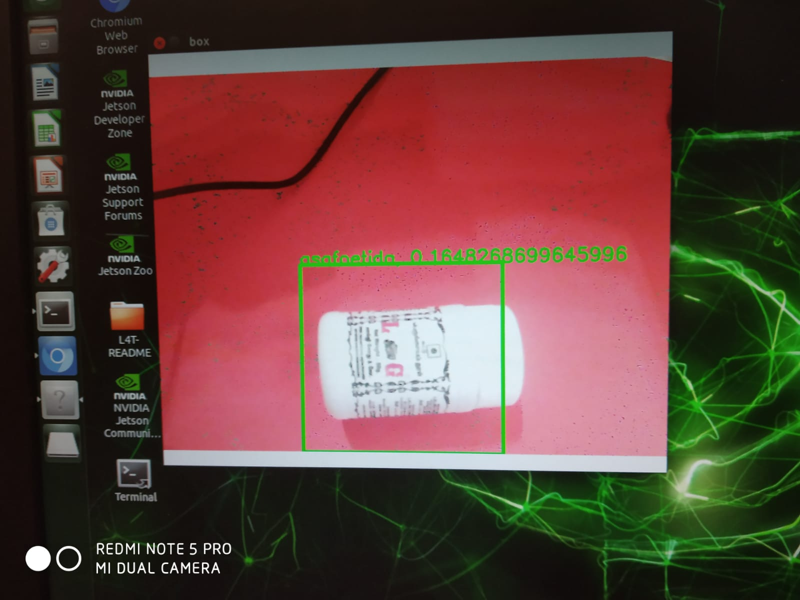
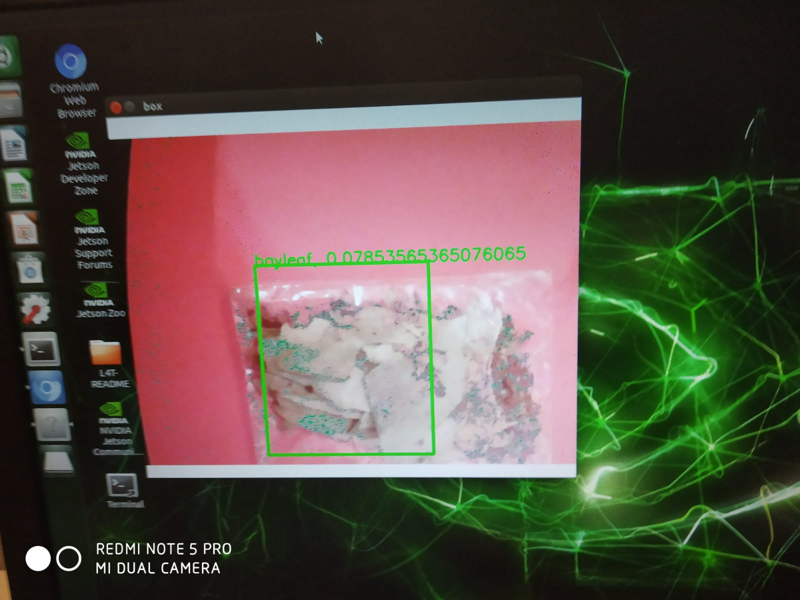

# Spices-Detection-in-Warehouses
The main idea is to detect spices. The model is trained with training samples from objects such
as cardamom, bayleaf, asofoetida and turmericTraining samples are divided into training
dataset and test data set. The train dataset is used to extract the significant features and the test
dataset is used to evaluate the features and to calculate the losses. Number of classes to be
trained is set to 4 classes, since the model being trained is expected to detect four classes namely
cardamom, bayleaf, asofoetida and turmeric 

##  Project Documents
- [Project Slides (PDF)](docs/Spices-detection-presentation.pdf)
- [Presentation Report (PDF)](docs/Spices-detection-report.pdf)

## Experimental Results

  > 
   a. spice asafoetida detection

   
  b. spice bayleaf detection

   
   c. spice turmeric detection

